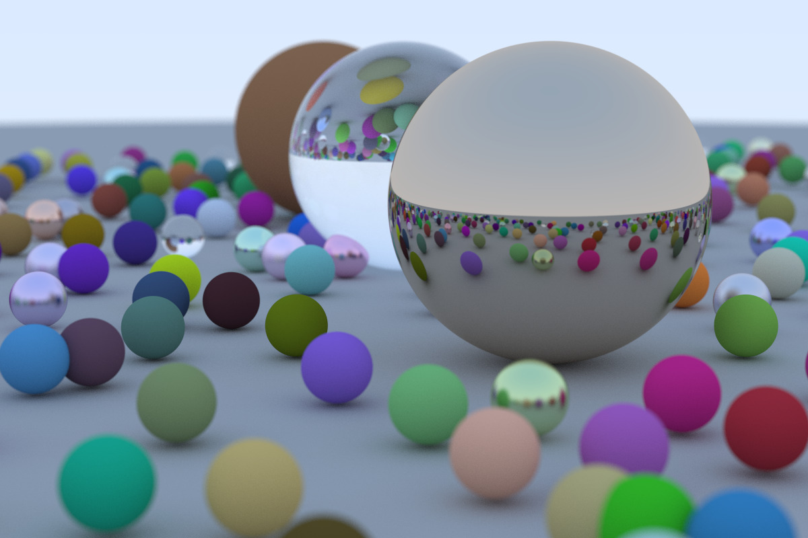

# Ray Tracing in One Weekend

This is a Rust :crab: implementation of [Ray Tracing in One Weekend](https://raytracing.github.io/books/RayTracingInOneWeekend.html) by Peter Shirley.

I've tried to align the commits to progressively follow the
sections in the tutorial. :link:

There are two branches: `main` and `concurrency`. The `main` branch
is perhaps arguably more readable to follow along with the
tutorial. After I finished Chapter 13, I parallelized the code
in the `concurrency` branch using the
[Rayon](https://github.com/rayon-rs/rayon) crate.

